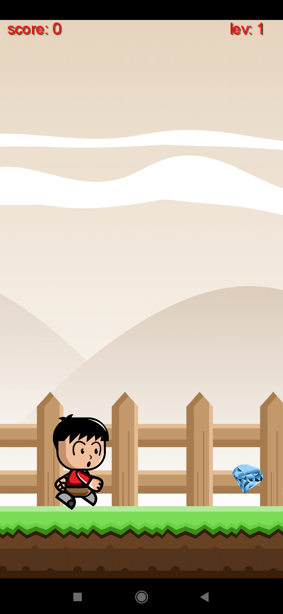
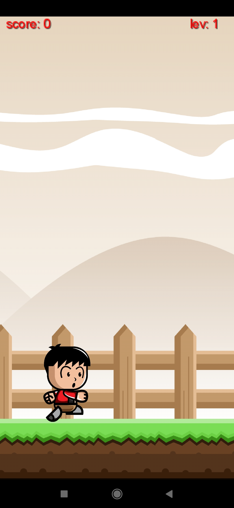
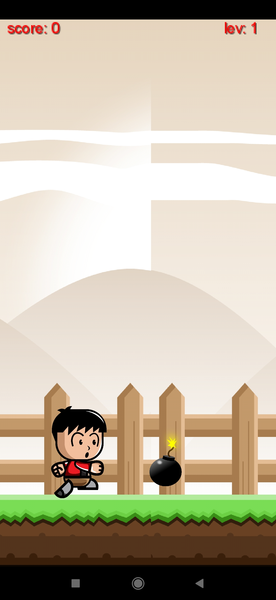
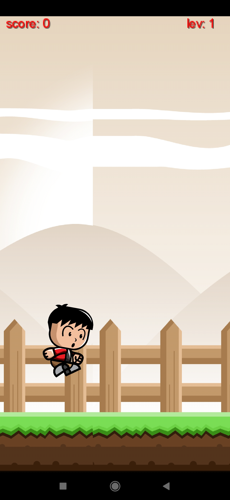

# Yamenai Game

_This game was built for practice purposes only in October 2020._

👉 [Demo video](https://youtu.be/d9F16xipcEc)
---

### The plot:

A character named Kojo should avoid bombs while gathering diamonds.

---

### Details & Features :

- The app uses the libGDX library
- At the beginning of the game, Kojo drops from the top.
- Kojo runs non-stop. Users can only make Kojo jump to avoid bombs.
   
  

  
  !
  
  

   

- As Kojo gathers more diamonds difficulty level of the game i.e. the running speed of Kojo and the frequency of bombs' occurrences will increase.
- When Kojo runs into a bomb, he explodes and the game stops. Users can either exit the game or restart the game.
   
   

  
  

   

- If users exit the game while playing, when they return to the app menu shows the following three options:
   
   

  
  

